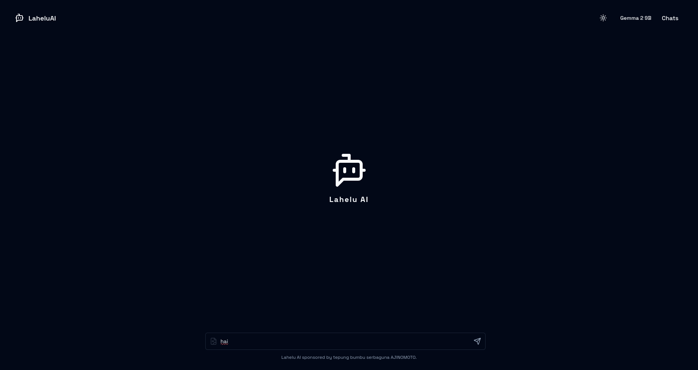
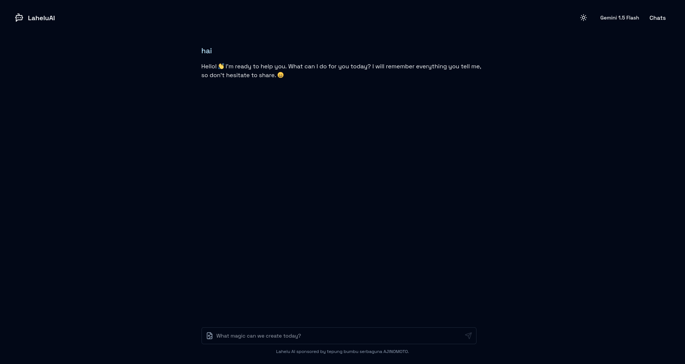
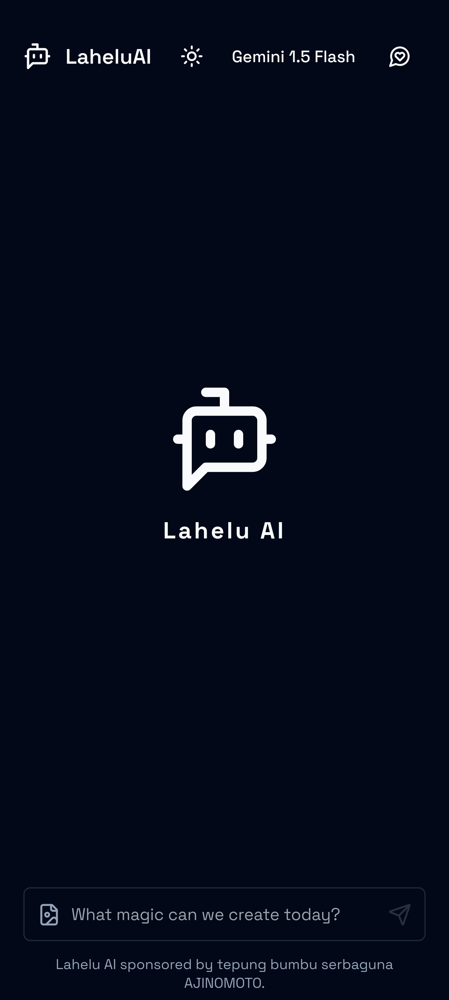
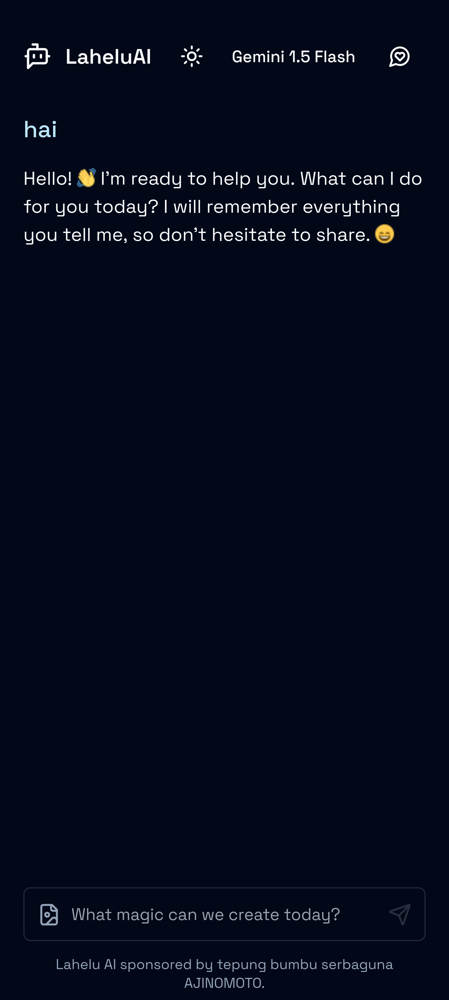

# 📝 Lahelu AI - Chatbot AI multi models 📝

AI Chatbot Application with Model Switching and Local Database Browser Integration

Explore the future of AI communication with our cutting-edge chatbot application. This app allows users to seamlessly switch between different AI models, providing flexible and personalized conversational experiences. Whether you need a model for casual conversation, professional assistance, or technical guidance, our chatbot has you covered.

## 🔑 Key Features:

- <b>Dynamic Model Switching</b>: Easily switch between multiple AI models to suit your needs.
- <b>Local Database Integration</b>: Utilize a local browser database for secure and offline data storage and retrieval, ensuring fast and reliable access to information.

## 🧑‍💻 Tech Stack

- <b>Front End</b>: Next.JS, React, Tailwind CSS,
- <b>Database</b>: Dexie.JS
- <b>Data Valiadtion</b>: zod
- <b>NLP</b>: LangChain

## 📷 Screenshot

- Desktop

**Without chat**

**With Chat**

- Mobile

**Without chat**

**With chat**

Thanks.
